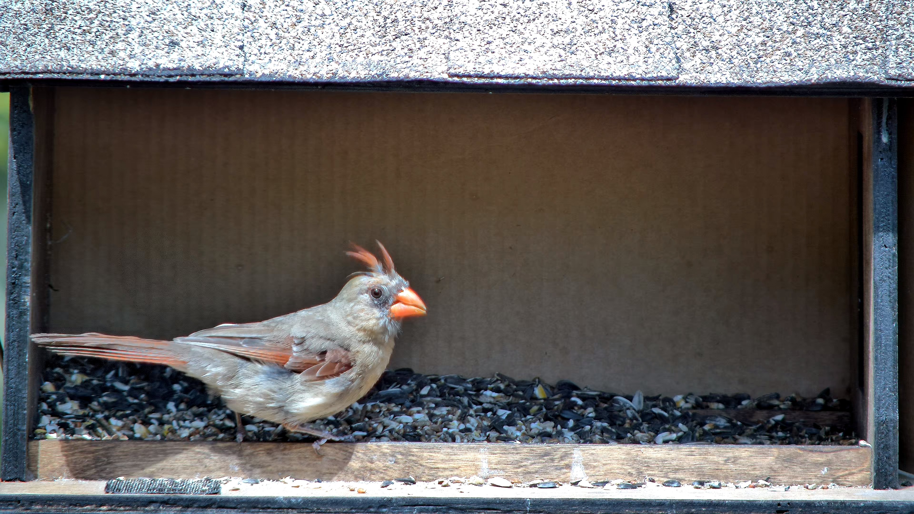
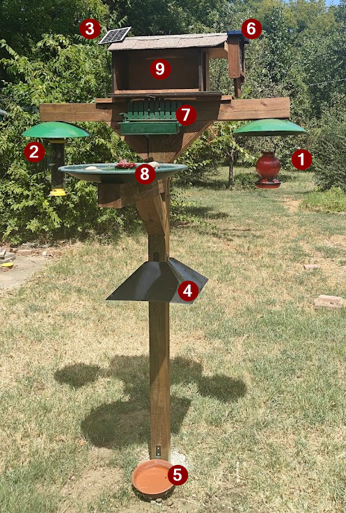
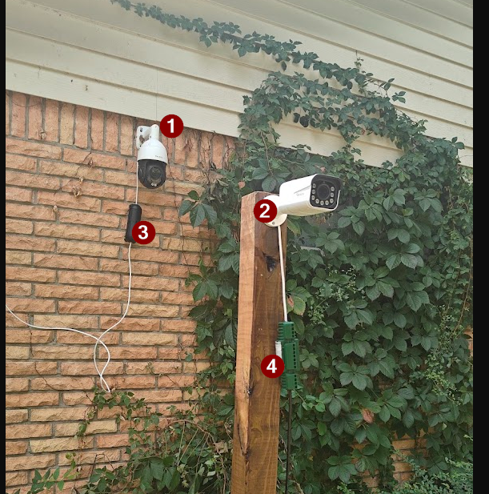
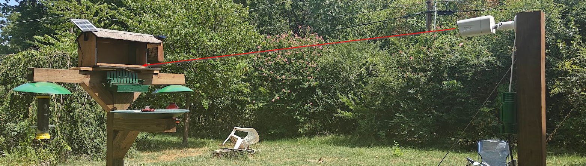
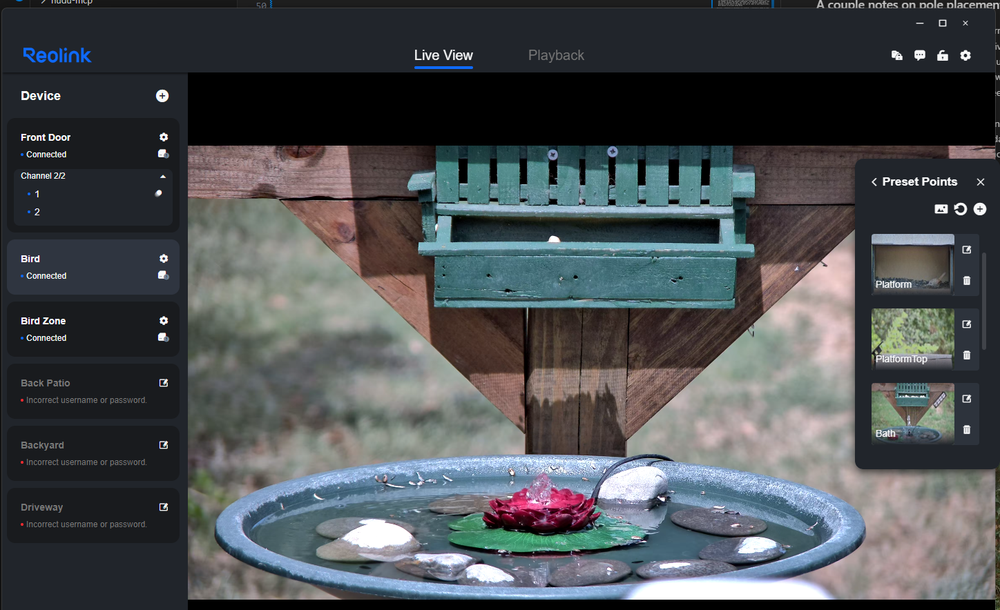
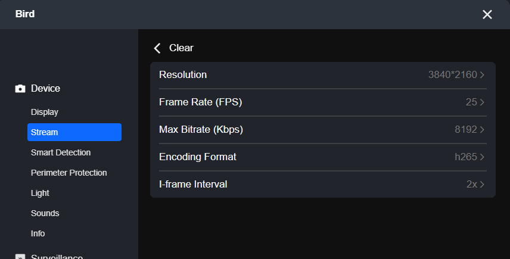
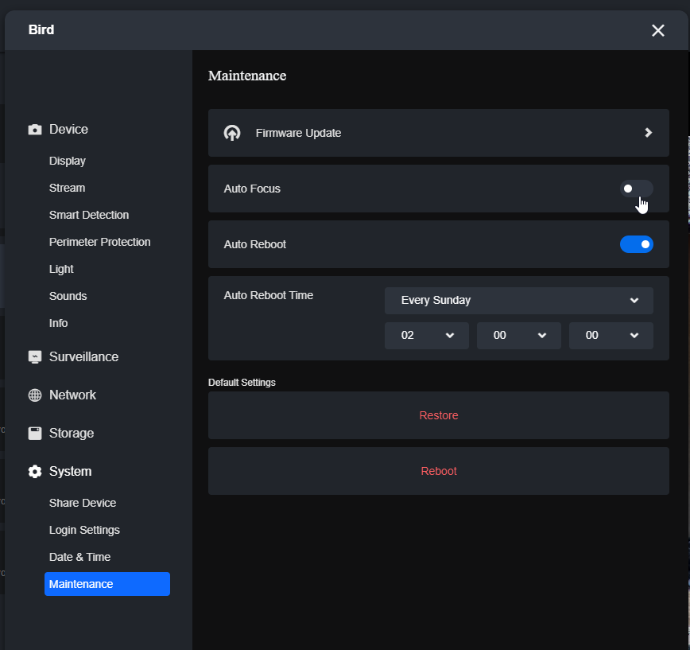
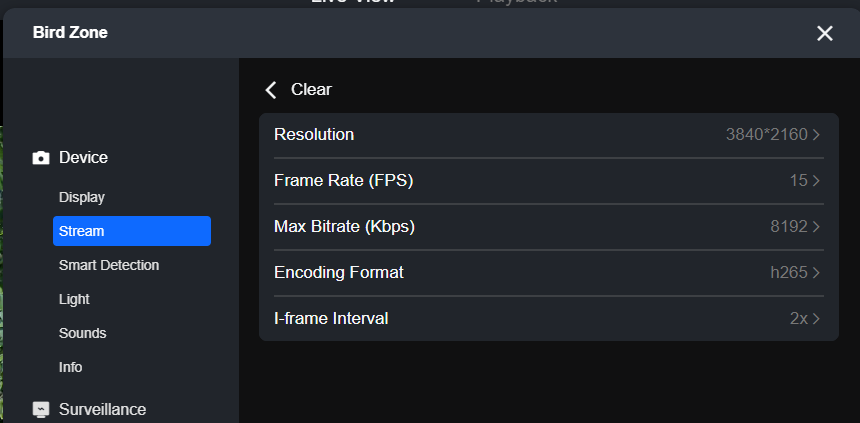
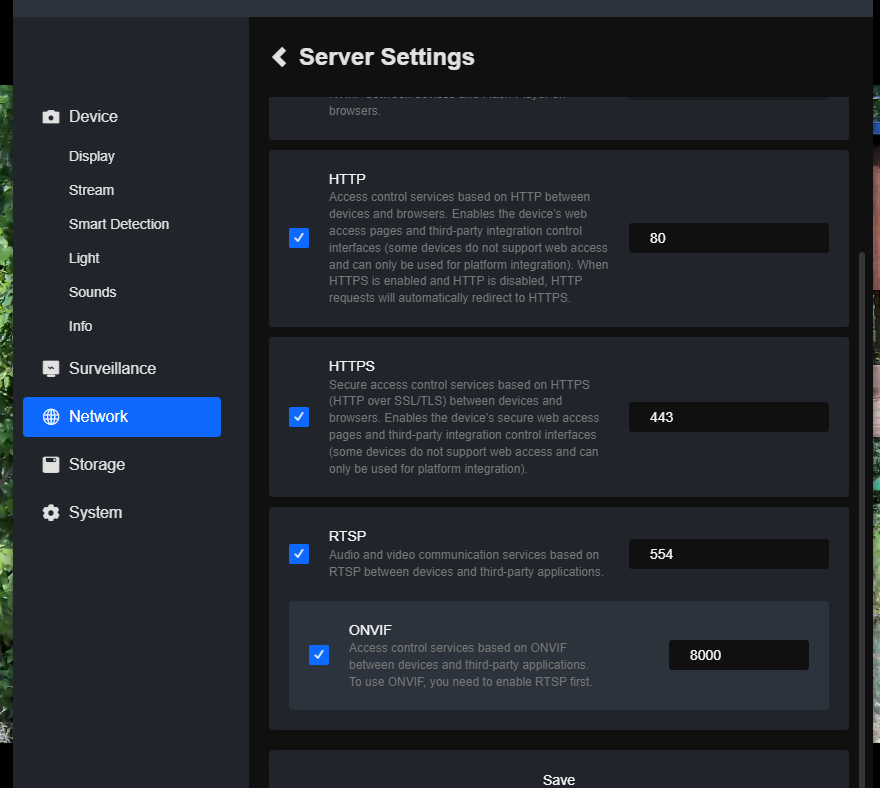
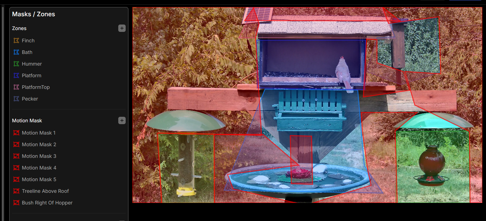

# My dual-camera Frigate/HA backyard bird writeup

This repo exists for me to link and say "This is how I did it!"

Disclaimer - Any of the links in here are affiliate links. I made the affiliate account specifically for this, not the other way around. I spent my time and money first, and got enough "What camera/pump/feeder/etc are you using" questions that I decided to sit down and make this writeup. The links (might?) help recoup some of my cost. I'll try to link everything I used along the way as I write this. We'll see how successful I am. 

## Money Shots (Downscaled for github)

All of these were taken by the camera in an automated fashion, with the camera 12ft away.

### Downy Woodpecker
https://github.com/user-attachments/assets/f5c6a15e-49df-40e8-a846-62808ed6e938

### Ruby Throated Hummingbird
https://github.com/user-attachments/assets/79e7fb66-84c4-454d-af08-3597fe508675

### Northern Cardinal

## Requirements / Prereqs (or at least, what I used. Do what you want.)

- Frigate NVR (https://frigate.video/)
  - Frigate+ is not required, but it will significantly increase your likelihood of getting positive bird IDs, especially with finetuning. It also supports the project

- Home Assistant (https://www.home-assistant.io/)
    - HA is not technically required to do this, but it makes the focus automations much simpler. Most cameras will not autofocus to your satisfaction, HA will allow automating focus levels at specific pan / tilt / zoom values.

- Birdnet-Go (https://github.com/tphakala/birdnet-go)
    - Audio classifications. Can consume RTSP streams to detect species by their calls/songs. I personally set this up early on so I had an idea of what species I should focus on attracting

- 2 total cameras. One to maintain zones, one to handle the zooming in. This is a hard requirement for this setup. If you try to do this with only one PTZ cam, the Frigate zones will get out of whack when it zooms and confuse the automations. If you want to maintain good quality at zoom, I recommend looking for cameras that have *optical* zoom, not digital. The cameras I use are:
    - PTZ Camera - [Reolink RLC-823S2](https://link.amazon/B0hDRs3DO)
    - Zone/Wide view Camera - [Reolink RLC-811A](https://link.amazon/B0efYPmBZ)

- Something to point the cameras at (hopefully, something that attracts birds!)
    - I personally used a 7' 4x4 post that I cemented into the ground. This was cheaper for me than buying a dedicated / purpose built "bird pole" but you can use whatever you want. The "arms" are 2' sections supported by 1' sections I miter saw'd 2 45 degree cuts out of. Rest is just stain/screws. More details on my pole setup below

- Optional - Something to aggregate your findings. I personally ended up vibe coding my own HA addon (Aviary) to handle both aggregation AND identification (so, Frigate detects a bird, my addon has a sidecar that uses a gpu to classify the species), but there are several options I'll list below
    - Nothing, Frigate can do bird ID natively, and both Frigate and Birdnet Go have UIs you can just open up and look at detections. You can then manage your list in eBird/Merlin/Whatever
    - [Aviary HA addon](https://github.com/chasem12345/HASS-Aviary) / docker sidecar - this is the addon I made. 
    - [WhosAtMyFeeder](https://github.com/mmcc-xx/WhosAtMyFeeder) - This one is kind of the OG frigate sidecar that a lot of people use
    - [YAWAMF](https://github.com/Jellman86/YetAnother-WhosAtMyFeeder) - This one is based on WAMF (above) and is what I loosely based Aviary off of

## The Pole

As I mentioned, I opted to just concrete a 4x4 post into the ground, and used more sections of 4x4 

In order (With links where applicable)

1. [Hummingbird feeder](https://link.amazon/B03ODG0xn)
2. [Finch Feeder](https://link.amazon/B08VO2XnF) (linked one is slightly different, unable to find my exact one I purchased locally)
3. [Solar pump](https://link.amazon/B0cwrL98P) - This one is nice because the panel is separate from the pump, so the pump can be in the bath itself, and works when the bath is shaded. It's also the only one that hasn't died quickly. Easy to clean too, since it comes apart
4. [Squirrel baffle](https://link.amazon/B0bg3bDsw) - A must
5. [Water Dish](https://link.amazon/B0d6Wghfe) - This is advertised as a birdbath, but I use it to put out water for the mammals. Squirrels need to drink too. Especially on these 110 degree summer days.
6. [Suet Feeder with tail prop](https://link.amazon/B08t5WzX3) - for the woodpeckers.
7. Random feeder I put peanuts in. This was homemade locally, no link. Jays grab the peanuts out of it.
8. 24" birdbath dish I bought locally and drilled a hole through
    - Inside, I have some random stones I bought at Lowes and a [copper disk](https://amzn.to/4xt3myW) to keep bacteria away, drilled hole / screw sealed with some random [aquarium sealent](https://amzn.to/4ycsM41).
9. This platform feeder was custom made. The plans are in reference/feederplans. These were laser cut out of 0.5" wood. Originally it made to have a camera mounted directly on it, but I had a lot of squirrel issues and moved it to a pole. files can be loaded into lightburn. I just stapled some spare shingles on top.
10. [Peanut feeder](https://link.amazon/B03VhaKhM) - chickadees, woodpeckers, wrens, etc

### A couple notes on pole placement - 

1. Keep it ~10ft from anywhere a squirrel can jump from. Those suckers are crafty. Mine is about 12ft from my house, and otherwise relatively far
2. Baffles, they work. Mount them 4'+ up the pole. Stopped my squirrel issue entirely
3. Staging - Birds need to stage. They want to sit somewhere and watch before committing. My staging area is the brush behind and the trees around. If you stick it in an open field with no staging, you may have issues
4. Cover - I notice my feeder goes silent when the hawks/kites come out. I have ordered a [half patio umbrella](https://link.amazon/B0dkCoBFY) to mount overtop, will update this when/if I have it mounted. That should keep it cooler and protected from birds of prey. The moving water from the pump will attract birds via sound.
   - Update, I added this to the pole and it works excellently.

## The camera(s)

 

1. [Reolink RLC-823S2](https://link.amazon/B0hDRs3DO) - PTZ cam, 16x optical zoom, mounted high up on an extremely stable surface (brick wall, it's heavy as hell and sensitive to movement. I'd not trust it on the top of a tall pole.)

2. [Reolink RLC-811A](https://link.amazon/B0efYPmBZ) - Zone camera. Static, stays zoomed in. My pole was a little too far from the house to get good quality zoom, so I put this on a dedicated 4x4 post. This does have 5x optical zoom, but it wasn't enough to get the framing how I wanted it. It's about 8' from the bird pole give or take

3. (and 4) [Cable protector/ weather proofers](https://link.amazon/B0gLzZQzr) - Until I find the motivation to pretty up the cable situation, this is how I'm protecting the ethernet connections

On the RLC-823S2 camera, I've got presets for each area I wanted it to focus on. This is done in the reolink app.

The relevent settings for each camera are below:

### RLC-823S2

Auto focus off because it really does suck on this camera.

### Reolink RLC-811A

### both

Both cameras need RTSP/HTTP/ONVIF turned on in network settings

## Frigate

Frigate is it's own beast, so I'll keep it top level. 

Hardware
- Dell R740
- GTX 1070 (for vram only, usage remains under 5% sustained). I had this laying around and just slotted it in.
- [Hailo 8](https://link.amazon/B06Zqoh5p) TPU
    - This was a requirement for me. It outperformed openvino and my old google coral by quite a bit. That said, I run 10 cameras total at fairly high resolutions, so openvino/gpu/etc may be sufficient for you. It was not for me.

For the zones, I have the zones configured in the zone cam:

You'll note - anything NOT in a zone is motion masked. This takes a lot of load off your detector, as it won't constantly need to run detect on leaves moving in the background

The relevant configs for both cams, trimmed from my main config. Detect is entirely off for the zoom cam. I let my sidecar addon handle this. I trimmmed all the zones but one so you can see the inertia setting. It's important.

[Config snippet here](reference\frigate\configsnippet.yaml)

## Home Assistant

This is where the magic happens. HA moves the PTZ cam based on Frigate zone presence, and also adjusts focus based on preset pan / tilt / zoom numbers (since reolinks auto focus sucks so bad)

### Integrations

1. Frigate HACS integration (needed for HA to be aware of zone presence)
2. Reolink integration (To control the PTZ cam and read/set focus)

## Configs

Both of these automations will require heavy tweaking on your end. Use them as a guide, they're not a drop in.

My honest recommendation is setup the HA MCP server and let your LLM of choice assist. Manually tune each zone / focus, and have it update the automation as you go. 

[Zone automation](reference\homeassistant\zoneautomation.yml)

[Focus Automation](reference\homeassistant\zoneautomation.yml)

